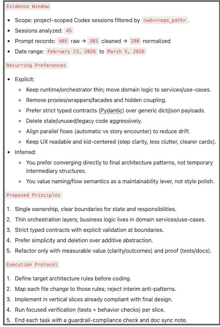

I’m building a simple nighttime simulation game called ZooPals for my kid: cute animals interact, short story moments appear via an LLM, and my kid reads and makes choices. The goal is to promote reading and learning in a lightweight, playable loop.

The codebase itself is not huge, and Codex implemented features quickly. However, the resulting code got messy because I changed gameplay direction in the middle. I had to go through quite a few refactor rounds to clean it up. Why? Because we repeatedly hit the same architectural drift patterns:

- orchestration code becoming too “thick”
- proxy/wrapper layers accumulating
- type and flow naming becoming harder to reason about
- similar logic paths diverging over time

After several rounds, I needed to know whether Codex was actually learning from our collaboration history, or only responding to the latest prompt and repo state. That is why I asked:

> “Is this new change pattern based on our past conversations, or just existing files in the project?”

This post is about what happened next.

---

### The key question

Can Codex evaluate our actual interaction history and adapt future behavior?

Short answer: **yes, it can**.

The interesting part is that it did not start there.

---

### Initial rejection, then recovery

First response from Codex was the typical limitation:

> “Just existing files in the project plus this current thread context. I don’t have a retrievable archive of all past conversations unless that content is saved in the repo…”

I pushed:

> “Aren't all our threads saved somewhere for this Codex project? Can you find a way to retrieve them?”

Then Codex changed from assumption mode to investigation mode:

> “I’ll check what local conversation artifacts are actually accessible from this environment…”

After probing local Codex artifacts, it confirmed:

> “Confirmed: session JSONL files contain full turn records and include `cwd`, so we can filter to this project precisely.”

And then:

> “I found 45 ZooPals sessions spanning February 23, 2026 to March 4, 2026.”

That was the turning point. We moved from “I don’t have history” to “**I can analyze project-scoped history**”.

Important scope note: this worked because session artifacts were locally accessible in my environment, and they included enough metadata (`cwd`) to filter reliably by project. This should be treated as an environment-dependent capability, not a guaranteed behavior in every Codex setup.

---

### What this proved

#### 1) Review-and-improve can actually be done
Codex was able to analyze real, project-scoped interaction history and derive repeated preferences, not just infer from one thread.

#### 2) The initial “can’t” was not the final capability boundary
The first answer reflected a default context assumption. With explicit pushback, Codex switched to a verifiable, history-backed approach.

#### 3) This can be operationalized, not just discussed
We converted historical patterns into persistent rules in project policy (`AGENTS.md`), then refined them to a stable set of core principles + an execution protocol.

---

### Why this mattered in my project

We had many refactors because the desired architecture was consistent in intent, but not consistently enforced in execution. I expected Codex to converge faster to solid patterns, and it often got there through intermediate designs first. That introduced churn.

So the real requirement became:

- not just “generate code,” but
- “learn my recurring constraints and apply them earlier.”

History awareness and review enabled exactly that. In practice, the changes were concrete:

- fewer "temporary" wrapper/proxy layers that later needed cleanup
- thinner orchestration changes in new tasks
- less naming churn across adjacent refactors

---

### Resulting collaboration contract

After Codex confirmed access to the thread history, I asked it to distill the interaction history into 5 reusable principles based on my own preference:

1. Single ownership, clear boundaries  
2. Thin orchestrators, focused domain logic  
3. Strict contracts over implicit behavior  
4. Prefer simplicity, delete aggressively  
5. Refactor with evidence and user value

And paired them with an execution protocol (plan against principles first, avoid temporary coupling, validate with targeted tests/docs).

This turned future work from reactive refactor cycles into a clearer, policy-driven flow.

---

### Why this is bigger than one project

This is not about a kids’ game only.  
It suggests a broader pattern for Codex workflows:

- Codex can move from stateless assistant behavior to **history-aware process behavior**
- user preference alignment can be explicit and persistent
- interaction quality can improve systematically over time

And I call it "HACT - **History Aware Collaboration Tuning**".

---

### Promote this into a Codex skill

The obvious extension is a reusable skill that can run periodically or after major changes and does:

- project-scoped history review
- preference extraction
- drift detection (where implementation diverges from recurring intent)
- suggested updates to guardrails/protocol

That would let Codex auto-evolve around each user’s (or project's) engineering style and reduce repeated alignment work across threads and projects.

So I asked Codex to generate one for me. And here it is.

[Codex HACT Skill - History Aware Collaboration Tuning](https://github.com/sidecus/hact)

Plase feel free to install it and try it in your Codex project. You'll be amazed.

---

### P.S.

This post was mostly written by Codex itself. :)
